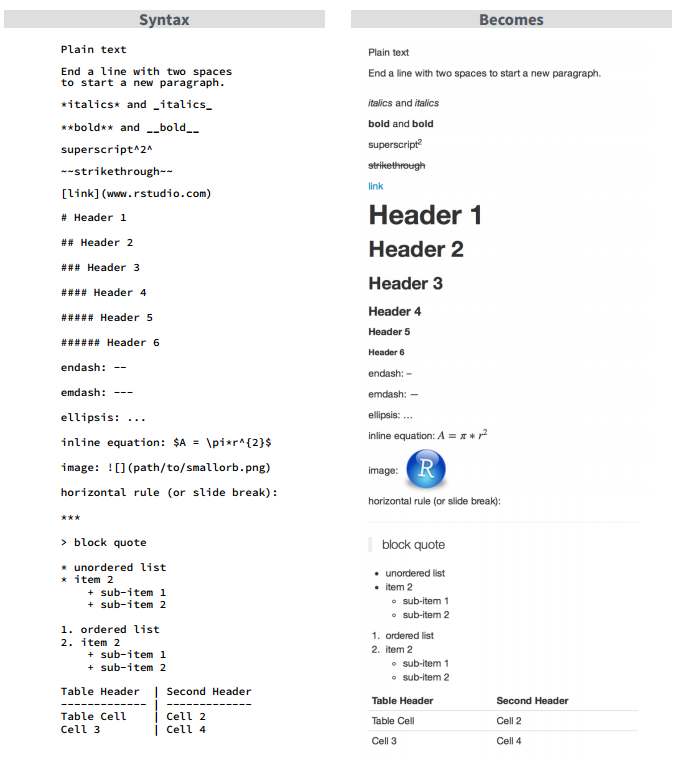
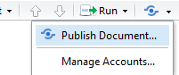

---
output:
  pdf_document:
    toc: true
    toc_depth: 3
    number_sections: true
---

```{r setup, echo=FALSE, message=FALSE, warning = FALSE}
library(knitr)
library(xlsx)
library(foreign)
library(dplyr)
library(tidyr)
library(plotrix)
# opts_knit$set(root.dir = "~/Dropbox/XtraWork/R stuff/RepResCoreSkillsR")
opts_knit$set(root.dir = "C:/Users/sfos0247/Dropbox/XtraWork/R stuff/RepResCoreSkillsR")
opts_chunk$set(warning=FALSE, message=FALSE)
options(scipen=999, digits=4)
```

\newpage

# Literate programming with `knitr` and `rmarkdown` 

> Instead of imagining that our main task is to instruct a computer what to do, let us concentrate rather on explaining to human beings what we want a computer to do.

*Donald Knuth (1984)*

The idea of literate programming focuses on *human readability*: whereas pure code contains the information about the **what** and the **how** of our analysis, but is missing information about the **why**; pure text can contain the **what** and the **why**, but be missing the **how**. 

A *knitted* document contains both code and text in a human readable document which are *knitted* together to produce a dynamically generated report. `knitr` then combines both types of information by executing the code and compiling a document that combines formatted text and the output of the code execution. 

Originally the `sweave` function was the main workhorse for literate programming in R. Sweave would combine R code and LaTeX mark-up language to produce `.pdf` reports. This functionality has now been greatly extended with the `knitr` package in that:

1. it allows several different mark-up languages to be used in addition to TeX, such as html, and in particular markdown, or rather Rmarkdown. 
2. it also allows several programming languages to be used such as python, C, Fortran etc. 

In combination with the `rmarkdown` package, these text files can be converted into html, but also into Word (`.docx`) files and  `.pdf` files.[^1]

[^1]: In order to produce .pdf files you do have to have a TeX distribution such as TeX Live of MikTeX installed on your system. 

But keeping it simple we will be producing a dynamic document from a simple text file, which combines:

* text formatted using Markdown
* R code both *inline* and in *chunks*
* passes options to `pandoc`depending on the type of output we want


## Markdown

Markdown is a lightweight mark-up language that allows text files to include formatting syntax while keeping the text eminently readable. This allows you to preserve the human readability of your work, make it future-proof and have it be easily convertible into other formats in addition to html. 

Some basic markdown syntax can be seen in Figure 1, which is taken from the RStudio reference sheet, which you can always easily access from RStudio directly by clicking on the Help menu and selecting Cheat-sheets. 



Technically we are actually using R Markdown - a variant of Markdown that allows you to also incorporate R code, as well as LaTeX and html code.

RStudio will automatically recognize and render markdown if you save a new file with the `.md` extension. But if you save it as `.Rmd` then it will not only render the markdown, but also execute any code chunks. In fact, there is no need to work in an `.md` file in RStudio, since Rstudio will automatically produce an `.md` file from an `.Rmd` as an intermediate stage in creating the final `.html` file.  

You can also do this by selecting File/New File/R Markdown, which will open a wizard and following your choices will open a template `.Rmd` file with examples of both Markdown and code chunks, ready for you to replace. 

Once you have a markdown document in RStudio, you can simply convert it to .html using the `Knit` icon at the top of the screen. Using the dropdown menu next to the `Knit` icon you can also choose whether to convert the file to `.docx` instead (`.pdf` will only work if you have a TeX distribution installed - i.e. unfortunately not on the IT services computers. )


## Code chunks

The syntax for inserting R code is to use three backticks before and after each chunk.  
    
    `r ''````{r chunk_name, chunk_options}
    print('hello world!')
    1 + 2
    ```

```{r foo, echo = FALSE}
print('hello world!')
1 + 2
```

Following the backticks is a set of curly braces indicating the language (`r`), the name of the code chunk, and any options: `{r chunk_name, chunk_options}`. You do not have to give chunks names, but it will make it easier to find errors if you do. 

Inline code is produced using simply tow backticks and the letter r, followed by an expression to be evaluated: `` `r '\x60r 1 + 1\x60'` ``

### Chunk options

For a exhaustive set of options refer to the Cheat-sheets, but some of the basic ones are described here, along with their default values:

* `echo = TRUE` - the code in the chunk gets displayed. Switch it to `FALSE` to suppress the code. You can also display only selected rows of code using a vector to index them e.g. `echo = c(3:5, 10)` will show rows 3, 4, 5 and 10. 
* `eval = TRUE` - whether or not the code in the chunk gets evaluated. Switch it to `FALSE` to suppress any results. Evaluating only selected rows is possible in the same way as with `echo`. 
* `error = TRUE` - whether or not errors generated by the code should be printed.Switch it to `FALSE` to suppress any errors - not recommended obviously.. 
* `message = TRUE` - whether or not messages generated by the code should be printed.Switch it to `FALSE` to suppress any messages.
* `warning = TRUE` - whether or not warnings generated by the code should be printed.Switch it to `FALSE` to suppress any warnings
* `results = 'markup'` - shows (text) results using the selected output hook (e.g. html). Switch to `'hide'` to suppress any results, to `'hold'` to wait for the whole chunk to evaluate before showing the results and `'asis'` if the results are already in mark-up (e.g. html tables). 

Plots in particular have a large number of options associated with them, again it is recommended you look at the documentation or Cheat-sheet for more information 

* `fig.show = 'asis'` will produce the plot, `'hide'` will suppress the plot in the final document. 
* `fig.height, fig.width = 7` - width and height of the figure in inches. 

Options can be set for each chunk individually, but they can also be changed globally using the `opts_chunk$set()` function in knitr at the start of the `.Rmd` file. In order to do this create a separate code chunk at the beginning for example: 


    `r ''````{r global_options, include=FALSE}
    knitr::opts_chunk$set(fig.width=10, fig.height=5, 
                      echo=FALSE, warning=FALSE, message=FALSE)
    ```

Placing this chunk at the beginning of our document would for example  ensure all plots are 10 by 5 inches, and that all of the code,  warnings and messages are suppressed. 


<!-- http://rmarkdown.rstudio.com/articles_verbatim.html-->


## Simple example
    
    #### Title of the report in medium sized letters
    
    Let's create a *random* variable x:
    
    `r ''````{r create_x}
    x <- runif(100)
    ```
    Now let's find the mean of x: 
    
    `r ''````{r mean_x, echo = FALSE}}
    mean(x)
    ```
    We can also plot a histogram of x
    
    `r ''````{r plot_x, fig.width = 5, fig.height = 3}
    hist(x)
    ```
    check what is in the environment?
    `r ''````{r list, echo = FALSE}
    ls()
    ```
#### Title of the report in medium sized letters{-}

Let's create a *random* variable x:
    
```{r create_x}
x <- runif(100)
```
    
Now let's find the mean of x: 

```{r mean_x, echo = FALSE}
mean(x)
```

We can also plot a histogram of x:
    
```{r plot_x, fig.width = 5, fig.height = 2.5}
hist(x)
```

check what is in the environment?
```{r list, echo = FALSE}
ls()
```

## Images in RMarkdown

The markdown code for inserting an image into your report is:

    `r ''`
    
Annoyingly the path to the image should be relative to the position of the `.Rmd` file, and not relative to the position of the `.Rproj` file, which is the reference for all other cases.[^2] 

Another issue with the markdown version of inserting images is that you have no control over size etc. This can be solved in a couple of ways, one is to use a code chunk to plot the image:

    `r ''````{r fig.width=4, fig.height=2,echo=FALSE}
    library(png)
    library(grid)
    img <- readPNG("path/to/your/image")
    grid.raster(img)
    ```
Another option (that also works in Rpresentations) is to use html:

    <div align="center">
    
    </div>

[^2]: But have a look at the `ezkintr` package for a neat solution to this problem. 


## YAML headers

If you opened an .`.Rmd` file from the menu, the default template already created a YAML header for your file. It might looks something like this:

    `r ''`---
    title: "Test knitted document"
    author: "me"
    output: html_document
    date: "7 March 2017"
    ---

You can play around with these options, and you can also remove them completely if you do not want title, author or date to be added to your document. The `output` option can be changed to `word_document` or `pdf_document` if you have a TeX distribution installed, but equally you can select the output options from the drop down menu. 

YAML headers are especially useful for defining additional formatting options such as table of contents style, .css options etc. For more detail check out 

* for html: <http://rmarkdown.rstudio.com/html_document_format.html>
* for Word: <http://rmarkdown.rstudio.com/word_document_format.html>
* for pdf: <http://rmarkdown.rstudio.com/pdf_document_format.html> 


## R Presentations

There exist now several ways of producing presentations within RStudio using RMarkdown, including:

* slidify (<http://slidify.org>) 
* ioslides (<http://rmarkdown.rstudio.com/ioslides_presentation_format.html>)
* beamer (<http://rmarkdown.rstudio.com/beamer_presentation_format.html>)
* R Presentations (<https://support.rstudio.com/hc/en-us/articles/200486468-Authoring-R-Presentations>)

All of these have pretty comprehensive sets of options and documentations, and the choice may well be down to personal preference, so it is only out of convenience that we will have a look at R Presentations here, as the native presentation format to RStudio. 

Again you can create a new presentation that will include a bit of a template by going through the RStudio template and selecting `File`, `New File`, and `R Presentation`, which will create a `.Rpres` file.

Then essentially all the R Markdown just described applies equally to `.Rpres` files as it does to `.Rmd` files, the main difference being that in a presentation you create a new slide using:

    `r ''`Title of slide 
    ================================================

Two columns will be rendered on a slide if you separate them using `***`:  

    `r ''`Two-Column Slide
    ================================================
    First column
    ***
    Second column

You can specify transitions between slides using the `transition` option. I The default is `linear`, other options are: none, linear, rotate,  fade, zoom, concave. f you define it on the first slide it will apply to the whole deck, otherwise just to the slide it is on:


    `r ''`First slide
    ================================================
    author: Maja
    transition: linear

Slides can also have a `type`, which changes its formatting, the types are: section, sub-section, alert, prompt.

Another useful option is the `id` field, which allows you to link to a specific slide:

    `r ''`Slide 1
    ====================================
    id: slide1

    Slide 2
    ====================================
    [Go to slide 1](#/slide1)
    
For more options, such as using a custom `.css` file, see the documentation. 

## Publishing to Rpubs 

So far we have been viewing our rendered `.Rmd` or `.Rpres` files either in the native RStudio viewer, or by opening them in the browser. You can see the file in the browser by clicking on the "View in browser" button in the viewer (under `More` if you are looking at a presentation). Alternatively you can open the html file directly from your file manager (or under `More` if you are looking at a presentation select `Save as web page` to save it as a .html file. 

But for even more convenience in disseminating your work you might wish to use RPubs, which allows you to publish html reports or presentations to the web directly from within RStudio. In order to do so you need to first create an Rpubs account. 

Go to <https://rpubs.com/users/new> to register a free account (if you land on the front Rpubs page, click on the `Register` button in the top right.) Once you have signed in simply open your `.Rmd` or `.Rpres` file in RStudio and click on the blue spiral icon to `Publish` your document or presentation.



Then select Rpubs, and follow the instructions: add the title and description to your file and a "slug" that will make your url link easy to recognise. 

RPubs does not automatically overwrite an existing presentation or report with a newer version - if you try to give it the same "slug" that has already been taken you will get an error - you have to delete the first one instead, then you can upload a new version with the same slug. 

# PRACTICAL 4 - Creating html reports and presentations in a reproducible, dynamic and modular manner

In this final practical you will bring together all the elements covered in this course. You will create a report and/or presentation using the data you cleaned in the first practical and the functions you created in the third practical.

When knitr is evaluating the code chunks it is starting from a clean new R session: that means none of the objects, data or functions are available unless you load them explicitly.

In order for this to work you will therefore need the following:

1. **data**: Make sure the `tidy.data.RData` file is in your `data` folder - or whatever is your equivalent location. 
2. **functions**: Create a new script file, e.g. `MyFunctions.R` and into it copy only the two functions to extract population pyramid data, and to plot population pyramids. Put it in your `scripts` folder - or whatever is your equivalent location. 
3. Open a new `.Rmd` file. Be careful where you save this file (I would suggest e.g. `presentations`) and make sure you are clear on the relative position of this file and the data and script files from points 1. and 2.

4. Now write the `setup` code chunk to include the following:

* load all the required packages (hint: you need two of them: they are the ones that will be required by the two functions, which won't work otherwise.)
* load the data 
* `source()` the script file - this means run the code in the `.R` file, which in our case loads the two functions.

Here be careful with the relative paths: `load()` and `source()` are *starting* from the presentation folder, so the correct path is probably something like this: "../data/tidy.data.RData" - where ".." refers to the parent directory i.e. one level up. Depending on your folder structure you will need to adjust these for both the data and the functions. If you do not get these right you will get an `Error in file` error. 

5. Once you have the setup chunk working, you can now write you report: For example you could produce a set of population pyramids for different countries, with a new section title for each one that uses in-line code to find the name of the pyramid. Thus you would need:

* one code chunk to assign the  `country` (e.g. `country <- "GZ"`)
* the section title which uses in-line code to find the correct country name
* the plot chunk which uses the plotting functions and the `country` variable to plot the correct pyramid. 

6. Once you have one country working you can copy these three elements and change the country variable each time.

7. If you still have time try creating a `.Rpres` with the same code, you only have to add slide separators and you should have a working presentation.  

8. If you have an RPubs account try to publish your work online!

If you need help you can find the *solutions* in the repository - these ones are in the `presentations\hidden` folder. 
